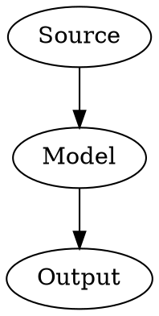

[md:profile]: md++
[md:profile-version]: 0.15
[md:require]: model.dot
[md:require]: diagram.dot.render

# Model Render Block


```dot model=system-graph
digraph G {
  Source -> Model
  Model -> Output
}
```

```diagram.dot.render source=system-graph
caption: System graph
```
