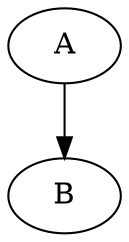

[md:profile]: md++
[md:profile-version]: 0.15
[md:theme]: ./theme.md
[md:require]: model.dot
[md:require]: diagram.dot.render

# Plugin Defaults From Theme



```diagram.dot.render source=system-graph
caption: Theme defaults example
```
