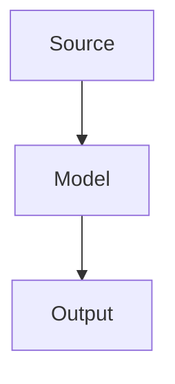

## Delivery Lifecycle {.layout-two-columns}

### Left {.left}

This page combines includes, layout classes, code, math, and diagrams.

```typescript
export const mode = "complete";
```

Inline math: $E = mc^2$.



### Right {.right}

```diagram.dot.render source=system-graph
caption: System graph
```
