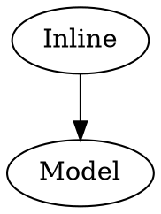

[md:profile]: md++
[md:profile-version]: 0.15
[md:require]: resource
[md:require]: model.dot
[md:model:system]: ./models/system.dot "dot"

# Duplicate External Model Name

```dot model=system
digraph G {
  Inline -> Model
}
```
