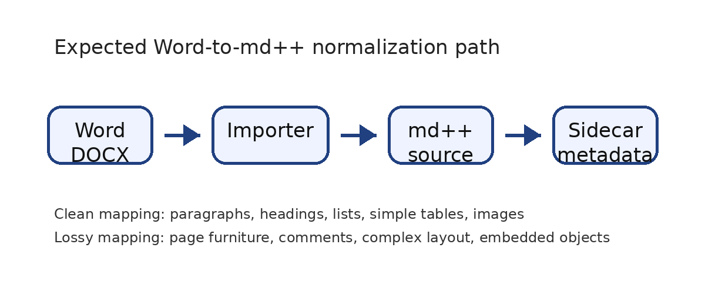
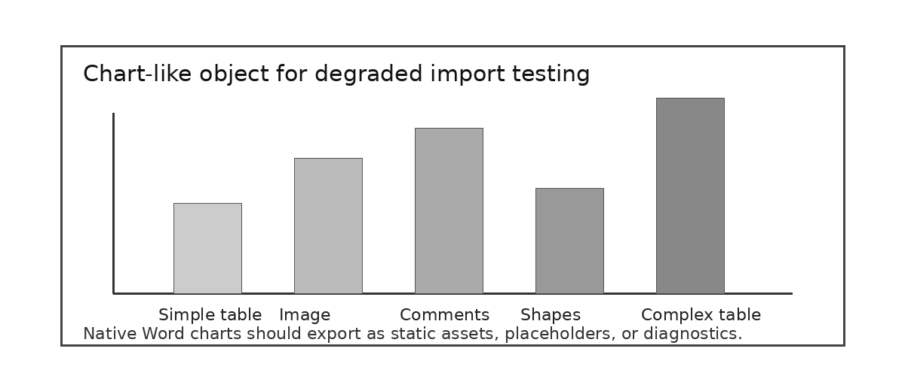

[md:profile]: md++
[md:profile-version]: 0.14
[md:title]: <Word export fixture import>
[md:theme]: themes/word-import.theme.md
[md:layout]: layouts/word-report.layout.md
[md:stylesheet]: styles/word-import.css

**md++ Word Export Fixture** {#fixture-title}

A DOCX test document for Word-to-md++ exporters {.word-style-mdpp-lead}

Purpose: explain the md++ language profile while exercising clean mappings, lossy mappings, sidecar metadata, and unsupported Office features. {.word-style-spec-note}

# Fixture map {#fixture-map}

This file is intentionally both documentation and a test fixture. The exporter should produce readable md++ plus diagnostics where fidelity cannot be preserved. {.word-style-mdpp-lead}

- Spec overview and expected md++ directives

- Word styles mapped to md++ classes

- Markdown-compatible body features

- Simple and complex tables

- Images, captions, links, bookmarks, and assets

- Headers, footers, page numbers, sections, and layout

- Comments, review metadata, and unsupported objects

- Exporter acceptance checklist

# 1. md++ spec overview {#spec-overview}

md++ keeps ordinary Markdown as the host language and adds directives, resources, capabilities, layouts, models, plugins, and output conventions. A plain Markdown renderer should still show useful content; a full md++ processor adds interpretation.

A Word style named Executive Summary should export as an author-facing class, for example {.word-style-executive-summary}, not as a hidden Word-only object. {.word-style-executive-summary}

COMMENT\_TARGET\_STYLE\_CLASS: This warning callout tests a named paragraph style that should map to {.callout-warning}. Unknown classes should remain in the Markdown source. {#word-comment-0 .callout-warning .word-style-mdpp-callout-warning}

Representative md++ document directives:

```
[md:profile]: md++
[md:profile-version]: 0.14
[md:title]: <md++ Word Export Fixture>
[md:status]: draft
[md:require]: include
[md:require]: layout.grid
[md:require]: diagram.mermaid
[md:require]: model.dot
[md:theme]: ./themes/company.theme.md
[md:layout]: ./layouts/report.layout.md
[md:stylesheet]: ./styles/local-overrides.css
```

# 2. Word-to-md++ mapping matrix {#mapping-matrix}

| **Word source feature** | **Expected md++ target** | **Exporter assertion** | **Diagnostic expectation** |
| --- | --- | --- | --- |
| Document title/properties | \[md:title\], metadata | Preserve title and status when available | none |
| Heading 1-4 | # through #### | Preserve hierarchy and generated anchors | duplicate anchors are errors |
| Named styles | attribute-list classes | Map safe names to {.word-style-name} | unknown classes normally kept |
| Body paragraphs | Markdown paragraphs | No Word-only style objects in body | none |
| Simple table | GFM table | Header row and cells preserved | none |
| Merged/complex table | component block or fallback HTML/asset | Do not flatten silently | MDPP0700-range when degraded |
| Images | !\[alt\](asset) | Extract asset and preserve alt text/caption | warning if missing asset |
| Header/footer/page number | theme page-furniture | Map slots and page-number tokens | MDPP0418 if page count unavailable |
| Comments | sidecar YAML/JSON | Anchor comments to block id/range | MDPP0700-range for degraded anchors |
| Freeform text box/shape | asset, placeholder, omission, or diagnostic | Do not treat as normal body flow | MDPP0700-range |

# 3. Markdown-compatible body features {#body-features}

Inline formatting: **strong text**, *emphasized text*, inline code `model=system-graph`, and an external link to [a placeholder exporter URL](https://example.org/mdpp-exporter-test).

Nested list test:

- First bullet should remain an unordered Markdown item.

  - Nested bullets should preserve indentation.

1. Numbered sequence should become an ordered Markdown list.

1. Second ordered item checks numbering continuity.

> Block quote test: md++ should preserve ordinary Markdown block quote semantics before applying theme or layout interpretation.

Fenced code block test:

```typescript
interface MdExportResult {
markdown: string;
diagnostics: MdDiagnostic[];
sidecars: MdSidecar[];
}
```

Inline math target: $E = mc^2$ should remain Markdown-compatible text if no equation converter is available.

Word equation object: E = mc²

Exporter note: if Word equation OMML can be converted to LaTeX, emit md++ math. Otherwise emit source text, placeholder, or a diagnostic. {.word-style-spec-note}

# 4. Tables {#tables}

Simple table expected to export as a GFM table:

| **Construct** | **md++ meaning** | **Expected output** |
| --- | --- | --- |
| \[md:require\] | Capability requirement | directive line |
| \`\`\`dot model=NAME\`\`\` | Model registration | absorbed model block |
| ### Left {.left} | Area binding | heading with class |
| !\[alt\](asset.png) | Image asset | Markdown image |

COMMENT\_TARGET\_TABLE: The next table deliberately uses merged cells and nested-looking content. It should not be forced into a plain GFM table if structure would be lost. {#word-comment-1 .callout-warning .word-style-mdpp-callout-warning}

**Complex Word table: merged title row plus mixed content**

| Vertical group / (merged cells) | **Case** | **Expected md++ target** | **Reason** |
| --- | --- | --- | --- |
| Vertical group / (merged cells) | nested list-like content | component block | GFM cannot preserve merged geometry |
| Vertical group / (merged cells) | manual line breaks | fallback HTML or diagnostic | structure is richer than simple Markdown |

# 5. Images, captions, links, and anchors {#images-assets}

Image test: exporter should extract this PNG as an asset, preserve alt text, and keep the caption nearby.

{.word-image width="418pt" height="181pt" data-word-layout="inline"}

Figure 1. md++ Word-to-md++ asset pipeline; expected Markdown image with alt text and caption. {#fig-mdpp-pipeline .word-style-caption}

Internal anchor test: this sentence refers to Figure 1 by a named bookmark. Exporters may convert bookmarks to explicit anchors such as {#fig-mdpp-pipeline}.

# 6. Page furniture and layout {#page-furniture-layout}

This document has a different first-page header, a running header, and a footer with PAGE and NUMPAGES fields. The md++ target should prefer theme page-furniture definitions instead of duplicating repeated header/footer text in body flow.

```
## page-furniture report
header-left: {document.title}
header-right: {page.number}
footer-center: Confidential fixture
number-format: {page.number} / {page.count}
```

Section and page-break test: the next page is landscape to test layout/page model normalization. A simple exporter may emit a layout resource, a page attribute, or a diagnostic if it cannot preserve orientation. {.word-style-spec-note}

---

# 7. Landscape layout and unsupported Office objects {#landscape-unsupported}

This landscape section checks page geometry, section breaks, freeform objects, and degraded visual constructs. {.word-style-mdpp-lead}

|  | **1fr** | **1fr** | **1fr** |
| --- | --- | --- | --- |
| auto | title | title | title |
| 1fr | left | center | right |

The table above is content that explains layout resources. It is not a Word layout engine. It should export as a simple Markdown table. {.word-style-spec-note}

Unsupported freeform layout object below:

COMMENT\_TARGET\_UNSUPPORTED: The text box above is an unsupported freeform object test. Exporter should emit a static asset, placeholder, omission, or MDPP0700-range diagnostic. {#word-comment-2 .callout-warning .word-style-mdpp-callout-warning}

{.word-image width="374pt" height="162pt" data-word-layout="inline"}

Figure 2. Chart-like visual: native Word charts should degrade to asset, placeholder, or diagnostic; this fixture includes a static image analogue. {.word-style-caption}

# 8. Comments and review metadata {#review-metadata}

This section includes real Word comments added after document creation. The expected md++ export is a sidecar file such as root.md.comments.yaml, with anchors to headings, paragraphs, or generated block identifiers.

Tracked change seed sentence: This sentence intentionally contains the phrase tracked-new-mdpp-term for review metadata testing.

If tracked changes are unsupported by the exporter, emit review metadata to a sidecar or produce a diagnostic rather than silently accepting or discarding the change. {.word-style-spec-note}

# 9. Exporter acceptance checklist {#acceptance-checklist}

| **Check** | **Expected result** | **Pass criterion** |
| --- | --- | --- |
| Metadata | \[md:profile\], \[md:title\], \[md:status\] | Document identity captured |
| Styles | {.word-style-\*}, {.lead}, {.callout-warning} | Safe classes preserved |
| Core Markdown | headings, paragraphs, lists, links, code, math | Readable plain Markdown fallback |
| Resources | images extracted and referenced | Alt text and captions preserved |
| Tables | GFM for simple, diagnostic/fallback for complex | No silent structural loss |
| Page furniture | theme/layout page-furniture | Headers, footers, page fields not duplicated as body |
| Sidecars | comments/review notes externalized | Comment text and anchor references preserved |
| Diagnostics | MDPP0700 range for unsupported Office constructs | Each lossy decision is reported |

The output should be useful as md++ even when not every Word visual feature is preserved exactly. {.word-style-mdpp-lead}
