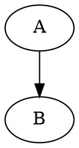
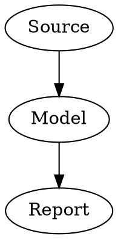
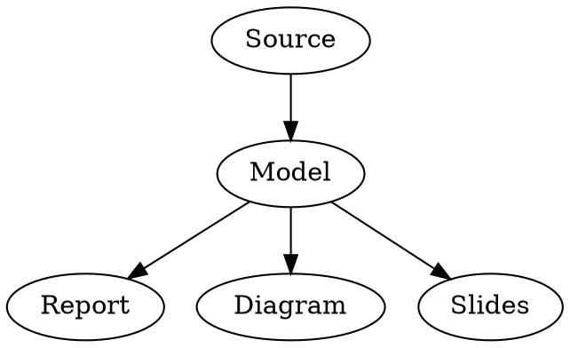

# md++ Language Specification

[md:profile]: md++
[md:profile-version]: 0.15
[md:title]: <md++ Language Specification>
[md:status]: draft

Status: draft 0.15  
File type: Markdown-compatible extension profile  
Canonical extension: `.md`

This document defines the portable md++ Markdown-based authoring profile: syntax, author-visible semantics, rendering conventions, layouts, models, and diagnostics.

Implementation architecture, provider APIs, typed runtime artifacts, workers, jobs, DOM patches, plugin lifecycle details, plugin manifests, and IPC/RPC details are defined separately in `mdpp_reference_runtime_architecture_v0_15.md`.

Stable diagnostic codes are maintained separately in `mdpp_diagnostic_catalog_v0_15.md`.

Reference implementation plugin/component planning is maintained separately under `implementation/` in the release bundle.

---

## 1. Purpose

md++ is a Markdown-compatible authoring profile for documents as code.

md++ targets repeatable, style-consistent technical documents. Authors should normally express structure and semantic intent in Markdown, while themes, formatting templates, layouts, and stylesheets apply consistent presentation.

It keeps ordinary Markdown as the host language and adds a small set of conventions for:

- document directives;
- includes and repositories;
- resource references for plugins;
- capability requirements;
- theme resources;
- formatting templates;
- stylesheet resources;
- layout resources;
- syntax highlighting;
- math formulas;
- renderable diagrams;
- named model blocks;
- external model resources;
- plugin-owned rendering blocks;
- page and slide layouts;
- named layout areas;
- area-local flow and pagination;
- output conventions for HTML, PDF, print, slides, and images.

The same syntax is intended to describe md++ itself, other specifications, reports, slide decks, architecture documents, diagrams, and model-derived documents.

A plain Markdown renderer should still show useful content. md++ processors add stronger interpretation where supported.

### Conformance, normative keywords, and base Markdown

The base Markdown standard for portable md++ documents is GitHub Flavored Markdown (GFM), including the CommonMark core syntax and the GFM table extension. A conforming md++ processor MUST parse ordinary Markdown constructs according to GFM before applying md++ interpretation.

The md++ language profile adds directives, fenced-block attributes, model registration, external model resources, repository-qualified references, layout resources, and presentation conventions on top of GFM. It does not redefine ordinary Markdown paragraphs, headings, emphasis, links, images, lists, block quotes, code blocks, or tables.

The capitalized words MUST, MUST NOT, REQUIRED, SHOULD, SHOULD NOT, RECOMMENDED, MAY, and OPTIONAL are normative when they appear in this specification. Lowercase uses of those words are ordinary prose.

A host MAY support additional Markdown extensions, but portable md++ documents MUST NOT rely on extensions outside GFM and md++ unless they declare a host-specific capability requirement.

A processor MUST preserve repeated `md:` directives in source order, even when a Markdown parser would otherwise collapse repeated link-reference labels.

---

## 2. Design principles

1. **Markdown remains the host language**  
   Headings, paragraphs, lists, links, images, tables, block quotes, inline code, and fenced code blocks keep their normal GFM Markdown meaning.

2. **Extensions must degrade safely**  
   Unsupported directives should be invisible or harmless. Unsupported fenced blocks should remain visible as ordinary code blocks.

3. **Document directives use Markdown link-reference syntax**  
   Document-level md++ instructions are expressed as Markdown-compatible link-reference definitions:

   ```markdown
   [md:profile]: md++
   [md:require]: diagram.mermaid
   [md:include]: ./chapters/intro.md
   [md:theme]: ./themes/company.theme.md
   [md:stylesheet]: ./styles/spec.css
   [md:layout]: ./layouts/two-columns.layout.md
   ```

4. **Fenced blocks are extension boundaries**  
   Diagrams, models, data blocks, and plugin rendering requests use fenced code blocks with info strings.

5. **Model definition and rendering are separate**  
   A fenced block with `model=...` or an external model directive defines reusable content. Rendering happens through ordinary block processing, delegated to plugins.

6. **Plugins own specialized behavior**  
   md++ core recognizes syntax and dispatch points. Plugins define how to parse, validate, render, or otherwise process specialized content types.

---

## 3. Terminology

| Term | Meaning |
|---|---|
| Host | Application or processor reading md++ content |
| Processor | Component that parses and resolves md++ syntax |
| Renderer | Component that produces rendered output from md++ content |
| Plugin | Capability provider loaded or selected by the host |
| Pipeline | Named processing path, often supplied by a plugin |
| Directive | Markdown link-reference definition whose label starts with `md:` |
| Resource | External file or repository item requested through the host |
| Repository | Named root used for includes and plugin resources |
| Repository-qualified reference | Reference of the form `repository-name:path/inside/repository.ext` |
| Repository-scoped requirement | Capability requirement whose capability is resolved in the context of a named repository |
| Theme | Bundled presentation resource that may declare design tokens, formatting templates, layouts, and stylesheets |
| Formatting template | Theme-owned rule set that assigns CSS-facing classes to elements in a section subtree |
| Section semantic class | Heading class used as ordinary CSS class and, when matching presentation names, as a formatting-template and layout-area selector |
| Layout | Resource that defines page, slide, canvas, grid, area, and flow structure |
| Stylesheet | CSS or host-supported styling resource applied to rendered output |
| Model block | Fenced block with a `model=...` instruction |
| External model directive | Document-level directive of the form `[md:model:NAME]: RESOURCE ["INFO-STRING"]` that registers a model from an external resource |
| Parser selector | First token of a fenced block info string, used to select the parser, plugin entry point, or pipeline for a model or plugin-owned block |
| Model repository | Resolved set of named models in the document, including included files and external model resources |
| Plugin-owned block | Fenced block whose processing is owned by a plugin |
| Normal processing | Whatever the host would do with a block without md++ model absorption |
| Layout area | Named rectangular region in a page or slide layout |
| Page | Host-managed layout container used for pagination and PDF-oriented rendering |
| Rendered document | The author-visible output tree produced from an md++ document |

---

## 4. Relationship to ordinary Markdown

md++ preserves ordinary Markdown syntax.

The following remains ordinary Markdown:

````markdown
# Heading

Paragraph with **strong** text and [a link](https://example.org).

```python
print("hello")
```
````

md++ adds interpretation for directives, fenced block attributes, model registration, external model resources, plugin dispatch, layout declarations, and area flow.

Example:

````markdown
[md:profile]: md++
[md:profile-version]: 0.15
[md:require]: diagram.mermaid
[md:theme]: ./themes/company.theme.md
[md:layout]: ./layouts/two-columns.layout.md
[md:include]: ./chapter.md

## Slide title {.layout-two-columns}

### Left {.left}

Content for the left area.


````

A plain Markdown renderer may ignore the directives and display fenced blocks as code. An md++ renderer may include files, load plugins, fetch resources, render diagrams, process math, register models, and lay out pages.

---

## 5. File extensions

The recommended terminal file extension is `.md`, because md++ files are valid Markdown files and should remain recognizable to ordinary Markdown tools.

Recommended naming patterns:

| Pattern | Meaning |
|---|---|
| `document.md` | Markdown-compatible md++ document |
| `company.theme.md` | Theme resource written as md++ and parsed in theme context |
| `two-columns.layout.md` | Layout resource written as md++ and parsed in layout context |
| `company.css` | Plain CSS stylesheet resource |

The semantic suffix before the terminal extension is a convention. A plain `.md` file may also be used as a document, theme, or layout resource when referenced in that context. CSS stylesheets use the `.css` extension.

The profile name is `md++`. The directive namespace is `md:`.

---

## 6. Document metadata

Portable md++ metadata is declared using `md:` link-reference directives:

```markdown
[md:profile]: md++
[md:profile-version]: 0.15
[md:title]: <md++ Specification>
[md:status]: draft
```

A processor reads document metadata from these directives.

---

## 7. Link-reference directives

### General form

An md++ directive is a GFM link-reference definition whose label starts with `md:`. The directive MUST conform to the normal GFM link-reference definition shape:

```markdown
[directive-label]: destination [title]
```

For md++ directives, the destination is the directive value and the optional title is available only to directives that explicitly define title semantics, such as complex capability version constraints. A directive MUST NOT contain arbitrary trailing text after the destination and optional title.

Portable md++ directive values use one of these forms:

```markdown
[md:directive-name]: text-without-spaces
[md:directive-name]: <text with spaces and no angle brackets>
[md:directive-name]: text-without-spaces "quoted title once"
[md:directive-name]: <text with spaces and no angle brackets> "quoted title once"
```

A bare destination MUST NOT contain spaces or tabs. When the directive value itself contains spaces, it MUST be written as an angle-bracket destination. The angle-bracket destination content MUST NOT contain unescaped angle brackets.

A directive MAY have one quoted title after the destination only when the directive defines how that title is interpreted. Portable md++ directives MUST NOT use more than one title.

Examples:

```markdown
[md:profile]: md++
[md:title]: <Architecture Roadmap>
[md:require]: diagram.mermaid
[md:require]: diagram.mermaid ">=10 <11"
[md:include]: ./sections/overview.md
[md:include]: <./sections/overview with spaces.md>
[md:model:system-graph]: shared:models/system.dot "dot"
[md:theme]: ./themes/company.theme.md
[md:stylesheet]: ./styles/default.css
[md:layout]: ./layouts/report.layout.md
```

### Repeated directives

md++ allows repeated directives with the same label:

```markdown
[md:require]: diagram.mermaid
[md:require]: diagram.dot
[md:require]: math.latex
```

An md++ processor must collect all such directives in source order from the source text or concrete syntax tree. It must preserve repeated entries even when a Markdown parser would collapse duplicate link-reference labels.

Plain Markdown renderers may ignore these definitions.

### Core directives

The `md:` namespace is reserved for md++ directives.

The core directives defined in this draft are:

| Directive | Meaning |
|---|---|
| `[md:profile]:` | Declares the profile name |
| `[md:profile-version]:` | Declares the profile version |
| `[md:title]:` | Declares document title metadata |
| `[md:status]:` | Declares document status metadata |
| `[md:require]:` | Declares a required capability |
| `[md:include]:` | Includes or composes another Markdown-compatible file |
| `[md:model:*]:` | Registers a named model from an external resource |
| `[md:repository:*]:` | Defines a named include and resource root |
| `[md:theme]:` | Declares a theme resource |
| `[md:stylesheet]:` | Declares a stylesheet resource |
| `[md:layout]:` | Declares a layout resource |

Other `md:` directives are reserved for future md++ drafts or profiles.

---

## 8. Requirements

### Syntax

`md:require` uses the md++ directive form defined in section 7.

The requirement destination contains the capability selector and, optionally, a simple version constraint after `@`. The optional quoted title contains a version constraint for complex ranges.

Portable forms:

```markdown
[md:require]: capability
[md:require]: capability@simple-version-constraint
[md:require]: repository-name:capability
[md:require]: repository-name:capability@simple-version-constraint
[md:require]: capability "complex version constraint"
[md:require]: repository-name:capability "complex version constraint"
```

Examples:

```markdown
[md:require]: core@^0.15
[md:require]: include
[md:require]: diagram.mermaid@^10
[md:require]: diagram.dot
[md:require]: model.dot
[md:require]: math.latex
[md:require]: layout.grid
[md:require]: shared:diagram.mermaid@10
[md:require]: shared:model.dot@>=3
[md:require]: shared:diagram.mermaid ">=10 <11"
```

Formal grammar for the portable value, after normal GFM link-reference parsing:

```ebnf
require-value        ::= selector (space quoted-range)?
selector             ::= scoped-selector | capability-selector
scoped-selector      ::= repository-name ":" capability-selector
capability-selector  ::= capability-name ("@" simple-range)?
repository-name      ::= name
capability-name      ::= name ("." name)*
name                 ::= name-start name-char*
name-start           ::= lowercase-letter | digit
name-char            ::= lowercase-letter | digit | "-"
simple-range         ::= simple-range-char+
simple-range-char    ::= lowercase-letter | uppercase-letter | digit | "." | "^" | "~" | ">" | "=" | "-"
quoted-range         ::= markdown-title-string
space                ::= one or more spaces or tabs
```

The grammar intentionally keeps simple `@` ranges small. Simple ranges cover common cases such as:

```markdown
[md:require]: diagram.mermaid@10
[md:require]: diagram.mermaid@10.2
[md:require]: diagram.mermaid@^10
[md:require]: diagram.mermaid@>=10
```

Version constraints that contain spaces, `<`, `||`, parentheses, or other complex semver syntax MUST be written as the quoted title:

```markdown
[md:require]: diagram.mermaid ">=10 <11"
[md:require]: shared:diagram.mermaid ">=10 <11"
```

A requirement MUST NOT contain both an `@` constraint and a Markdown title constraint. If both are present, the processor MUST report an invalid requirement diagnostic.

The form `shared:diagram.mermaid@10` is valid GFM link-reference syntax. The prefix before the first colon is interpreted as a repository scope only when it matches a repository declared in the resolved document.

The capability selector itself normally uses the bare destination form because portable capability selectors do not contain spaces. If a future extension defines a requirement destination containing spaces, that destination MUST use the angle-bracket destination form defined in section 7.

### Meaning

`md:require` declares that a capability is needed to fully process or render the document.

Missing required capabilities should produce diagnostics. A host may continue with fallback behavior when safe.

A capability requirement consists of:

| Field | Meaning |
|---|---|
| Capability selector | Capability name, optionally scoped to a repository |
| Capability name | The required capability string |
| Repository scope | Optional repository name used to resolve a repository-scoped capability |
| Version range | Optional npm-compatible semver range |
| Source location | File and line where the requirement was declared, when available |

### Capability names

Capability names are strings.

Recommended portable capability names use lowercase letters, digits, dots, and hyphens:

```text
[a-z][a-z0-9.-]*
```

Recommended capability naming:

| Prefix | Meaning |
|---|---|
| `core` | Core md++ parsing and directives |
| `include` | Include resolution |
| `resource` | Host-provided resource fetching for plugins |
| `repository.*` | Repository support for named roots |
| `theme` | Theme loading and presentation bundle resolution |
| `stylesheet` | Stylesheet loading |
| `math.*` | Math parsing/rendering |
| `highlight.*` | Syntax highlighting |
| `diagram.*` | Inline diagram rendering |
| `model.*` | Model block parsing and registration |
| `layout.*` | Layout processing |
| `plugin.*` | Host/plugin-specific processing capability |

Capability naming is extensible. Host-specific names are allowed, but portable documents should prefer stable names.

### Repository-scoped requirements

A requirement may be scoped to a named repository by prefixing the capability selector with `repository-name:`:

```markdown
[md:repository:shared]: ./shared
[md:require]: shared:diagram.mermaid@10
[md:require]: shared:model.dot@>=3
[md:require]: shared:diagram.mermaid ">=10 <11"
```

The prefix is interpreted as a repository name only when it matches a repository declared in the resolved document. A repository-scoped requirement MAY appear before or after the corresponding repository declaration in source order. It is resolved only after the resolved document repository table has been built.

A repository-scoped requirement means that the required capability is expected from, or is resolved in the context of, that repository. Typical uses include repository-bundled plugins, repository-specific model types, repository-local themes and layouts, or organization-specific capabilities distributed with a shared content repository.

Repository-scoped requirements do not change the syntax of repository declarations. The repository still uses the ordinary directive form:

```markdown
[md:repository:shared]: URI
```

If the repository name is unknown after repository-table construction, the processor MUST report an invalid requirement or unknown repository diagnostic.

### Version constraints

Version constraints use npm package version semantics, restricted to a portable subset.

Portable md++ processors should interpret versions and ranges using the same core rules as npm semver ranges. Hosts may use an npm-compatible semver implementation directly.

Supported portable forms are:

| Form | Meaning | npm-compatible range meaning |
|---|---|---|
| `1` | Major version range | `>=1.0.0 <2.0.0` |
| `1.2` | Major/minor version range | `>=1.2.0 <1.3.0` |
| `1.2.3` | Exact version | `=1.2.3` |
| `^1` | Compatible with major version `1` | `>=1.0.0 <2.0.0` |
| `^1.2` | Compatible with `1.2` and later, before `2.0.0` | `>=1.2.0 <2.0.0` |
| `^1.2.3` | Compatible with `1.2.3` and later, before `2.0.0` | `>=1.2.3 <2.0.0` |
| `^0.6` | Compatible with `0.6` and later, before `0.7.0` | `>=0.6.0 <0.7.0` |
| `^0.6.3` | Compatible with `0.6.3` and later, before `0.7.0` | `>=0.6.3 <0.7.0` |
| `>=1.2.0` | Version greater than or equal to `1.2.0` | comparator |
| `<=1.2.0` | Version less than or equal to `1.2.0` | comparator |
| `>1.2.0` | Version greater than `1.2.0` | comparator |
| `<2.0.0` | Version less than `2.0.0` | comparator; use quoted title form in portable source |
| `>=1.2.0 <2.0.0` | Compound range | comparator set; use quoted title form in portable source |

Simple constraints using the `simple-range` grammar MAY be written after `@`. Compound constraints, constraints containing `<`, and constraints containing spaces SHOULD be written as the Markdown title.

Pre-release and build metadata follow npm semver semantics. Portable md++ documents should avoid pre-release constraints unless the intended host explicitly supports them.

Hosts may support additional version constraint syntax, but portable documents should use only the forms above.

If no version range is declared, any available implementation of the capability may satisfy the requirement.

### Capability resolution

The host resolves requirements against capabilities provided by the core processor, host, loaded plugins, and repository-scoped capability sources when applicable.

Resolution succeeds when a provider declares the requested capability name and satisfies the optional version range.

For an unscoped requirement, the host resolves the capability globally.

For a repository-scoped requirement, the host first resolves the repository name, then resolves the capability in the context of that repository. The exact provider-selection mechanism is host-defined and belongs to the reference runtime architecture.

If multiple providers satisfy the same capability, the host selects one according to host policy. The selected provider should be recorded in diagnostics or trace output when available.

A failed required capability resolution should produce a warning or error. The host may continue only when safe fallback behavior is available.

---

## 9. Includes, repositories, and resource references

### Include syntax

```markdown
[md:include]: ./relative/file.md
[md:include]: shared:chapter.md
```

### Include meaning

An include composes another Markdown-compatible document into the including document at the point where the directive appears.

After include resolution, the processor works with one resolved document tree. The resolved tree contains content from the root document and all included documents in source order.

Includes do not create independent document modules in the portable core profile. However, the processor must preserve source-file boundaries and source-origin information for:

- diagnostics;
- explicit anchors;
- generated anchors;
- model origins;
- layout and area bindings;
- plugin input context;
- traceability in generated outputs.

Models declared in included files become part of the resolved model repository for the including document.

Relative references inside an included file are resolved relative to that included file, using the reference resolution rules below.

Directive scope after include resolution:

- `[md:require]:` directives from included files are accumulated into the including document's resolved capability requirements in resolved source order.
- model blocks and `[md:model:*]:` external model directives from included files are accumulated into the including document's resolved model repository.
- `[md:repository:*]:` directives from the root document and included files contribute to one global repository table for the resolved document. Repository names are global within the resolved document.
- `[md:title]:`, `[md:status]:`, and other document metadata directives in included files describe the included source file only. They do not override root document metadata in the portable core profile.
- `[md:theme]:`, `[md:layout]:`, and `[md:stylesheet]:` directives from included files participate in the resolved presentation context in resolved source order unless the host parses the included file in a non-document resource context.

When `[md:include]:` appears inside a theme resource, the included file is parsed in theme context. Its theme declarations, formatting templates, theme-level includes, layout directives, stylesheet directives, plugin defaults, component defaults, assets, and font assets contribute to the including theme at the include position. They do not contribute ordinary document body content to the root document.

### Repositories

Repositories define named roots for includes and plugin resources:

```markdown
[md:repository:shared]: ./shared
[md:repository:corporate]: https://example.org/mdpp
[md:repository:design-system]: git:https://example.org/company/design-system.git
```

Repository names are global within the resolved document. A repository declared in the root document or in any included document contributes to the same resolved repository table.

Recommended portable repository names use lowercase letters, digits, dots, and hyphens:

```text
[a-z][a-z0-9.-]*
```

A repeated repository declaration with the same name and the same canonical resolved target should produce a warning. It is redundant but does not change the repository table.

A repeated repository declaration with the same name and a different canonical resolved target is an error. md++ does not allow repository shadowing, local overrides, or last-writer-wins behavior for repository names in the portable core profile.

The repository root value is resolved relative to the file that declares it, unless it is already an absolute URI, repository-provider reference, or another host-recognized absolute reference.

Repository-qualified references use:

```text
repository-name:path/inside/repository.md
```

The part before the first colon is interpreted as a repository name when it matches a registered global repository name. Otherwise, the reference is interpreted according to ordinary relative-reference or host URI rules.

Examples:

```markdown
[md:include]: shared:chapters/intro.md
[md:model:system-graph]: shared:models/system.dot "dot"
[md:layout]: shared:layouts/report.layout.md
[md:theme]: shared:themes/company.theme.md
[md:stylesheet]: shared:styles/default.css
```

### Reference resolution and nested includes

Every parsed source file has a source base. The source base is the directory-like location used to resolve relative references declared in that file.

Resolution rules:

1. A repository-qualified reference has the form `repository-name:path`. It is resolved from the root of the named repository, not from the current source file.
2. A relative reference such as `./chapter.md`, `../shared/logo.svg`, or `images/a.svg` is resolved against the source base of the file that contains the directive or block that requested the reference.
3. When an included file is loaded, its own source base becomes the directory containing that included file. Nested includes declared inside that file resolve from the included file's source base.
4. When an include crosses into a repository using `shared:chapters/intro.md`, relative references inside `intro.md` resolve inside the same `shared` repository, relative to `chapters/`.
5. Repository-qualified paths MUST be normalized by removing `.` segments and resolving `..` segments before access.
6. A repository-qualified path MUST NOT escape above the repository root after normalization. Escapes above the root are errors.
7. Relative references in ordinary filesystem-like sources are normalized using the same `.` and `..` rules. Whether such references may escape a local workspace root is host policy.
8. Repository names are matched exactly and case-sensitively.
9. Path separators in portable md++ references are `/`. Hosts MAY translate `/` to native separators internally.

Example:

```markdown
# root.md
[md:repository:shared]: ./shared
[md:include]: shared:chapters/intro.md
```

If `shared:chapters/intro.md` contains:

```markdown
[md:include]: ./details.md
[md:stylesheet]: ../styles/chapter.css
```

then `./details.md` resolves to `shared:chapters/details.md`, and `../styles/chapter.css` resolves to `shared:styles/chapter.css`.

### Plugin resource references

External model resources and plugin-requested resources use the same reference resolution rules as includes, themes, layouts, and stylesheets.

A plugin may request a resource using the same repository-qualified reference form:

```text
repository-name:path/inside/repository.ext
```

For example:

```text
shared:icons/database.svg
corporate:themes/company.theme.md
```

Relative resource requests should be resolved against the source file that contains the requesting directive or block, unless the plugin or host defines a more specific base.

For `[md:model:*]:` directives, the resource reference is resolved against the source file that contains the directive unless the reference is repository-qualified or absolute.

Plugins should not fetch external resources directly in portable md++ processing. Plugins ask the host for a resource, and the host either provides it or returns a diagnostic according to host policy.

### Include and resource errors

Processors should report diagnostics for:

- missing include files;
- unsupported schemes;
- circular includes;
- invalid repository names;
- repeated repository names with the same target;
- duplicate repository names with different targets;
- unavailable repository providers;
- inaccessible resources;
- resource requests denied by policy;
- invalid external model directives;
- invalid external model info strings;
- unsupported external model parser selectors;
- duplicate model names after include and external model resolution.

There is no optional include syntax in the portable core profile. If an include cannot be resolved or read, the processor should report a warning and continue processing the rest of the source document when practical.

---

## 10. Themes, formatting templates, layouts, and stylesheets

md++ separates presentation into authoring layers:

| Layer | Source | Typical user | Purpose |
|---|---|---|---|
| Theme | `[md:theme]:` resource | Average author | Apply a complete presentation package |
| Formatting template | Theme section | Theme author | Assign CSS-facing classes automatically from document structure |
| Layout | `[md:layout]:` resource | Intermediate author | Control page, slide, canvas, area, and flow structure |
| Stylesheet | `[md:stylesheet]:` resource | Advanced author | Control exact CSS styling |

A document may use only a theme:

```markdown
[md:theme]: ./themes/company.theme.md
```

The theme may then reference the layout and stylesheets needed to render the document. This keeps common documents simple while allowing more advanced authors to override specific layers.

### Theme directive

The theme directive declares a theme resource:

```markdown
[md:theme]: ./themes/company.theme.md
[md:theme]: shared:themes/company.theme.md
```

A theme resource is an md++ file parsed in theme context. It may contain design tokens, formatting templates, component defaults, plugin defaults, assets, page furniture, and may declare includes, layouts, and stylesheets using normal md++ directives.

A theme-level `[md:include]:` directive composes another Markdown-compatible theme file or theme fragment into the including theme at the directive position. The included file is parsed in theme context and contributes to the same theme resource unless a host-specific extension explicitly defines another resource context.

Example:

```markdown
# Company Report Theme

[md:profile]: md++
[md:profile-version]: 0.15
[md:title]: <Company Report Theme>
[md:layout]: ./report.layout.md
[md:stylesheet]: ./base.css
[md:stylesheet]: ./components.css
[md:include]: ./technical-writing.theme.md

## formatting
default-template: standard

## colors
primary: #204080
accent: #f2a900
text: #222
background: white

## fonts
body: Inter, sans-serif
heading: Inter, sans-serif
code: JetBrains Mono, monospace

## spacing
small: 4px
medium: 12px
large: 24px

## formatting-template standard

### rule first-section-paragraph
match-type: paragraph
match-position: first-of-section
apply-class: mdpp-lead

### rule ordinary-table
match-type: table
apply-class: mdpp-table

## formatting-template api-reference

### rule api-parameter-table
match-type: table
match-header-regex: ^Parameter\s*\|\s*Type\s*\|\s*Description
apply-class: mdpp-api-table
```

Recommended theme filenames end in:

```text
.theme.md
```

A plain `.md` file may also be used as a theme resource when referenced by `[md:theme]:`. If its content cannot be interpreted as a theme, the host reports diagnostics.

### Theme key/value declarations

Theme declaration groups use Markdown headings. Within a theme declaration group, portable key/value declarations use this form:

```text
key: value
```

The key is the non-empty text before the first colon and MUST NOT contain whitespace. The value is the remainder of the line after the first colon, with leading and trailing whitespace removed.

Values are strings until interpreted by the consuming theme, layout, stylesheet, plugin, or host property grammar. The `#` character, braces, commas, quotes, and additional colons inside the value have no special meaning in the core theme key/value syntax.

Examples:

```markdown
primary: #204080
body: Inter, sans-serif
padding: 0 0 {spacing.medium} 0
url: https://example.org/assets/logo.svg
```

Theme key/value declarations are not YAML. A portable processor MUST parse them using the md++ theme key/value rules, not a YAML parser.

### Theme contents

A theme may provide:

- design tokens such as colors, fonts, spacing, line weights, shadows, and palettes;
- included theme fragments;
- a default formatting template;
- named formatting templates;
- default layout references;
- default stylesheet references;
- component defaults;
- plugin presentation defaults;
- page furniture;
- asset and font references.

Theme vocabularies may evolve by profile and host. Portable themes should prefer simple Markdown headings and md++ key/value declarations.

### Theme composition

Themes are composable presentation resources. A document may apply multiple themes using repeated `[md:theme]:` directives, and a theme may use `[md:include]:` to split its own declarations across several files.

A theme included from another theme is processed at the include position in the including theme. Theme declarations from included files use the same resolution and override rules as declarations written directly in the including theme.

A theme that contains only formatting templates, only tokens, only layout or stylesheet references, or only plugin defaults is still an ordinary theme. The portable core profile does not define a separate formatting-template resource directive.

Example:

```markdown
# Company Theme

[md:profile]: md++
[md:profile-version]: 0.15
[md:stylesheet]: ./company.css
[md:include]: ./theme.tokens.md
[md:include]: ./theme.formatting.md
[md:include]: ./theme.plugins.md
```

A document may also compose theme layers directly:

```markdown
[md:theme]: ./themes/company-base.theme.md
[md:theme]: ./themes/technical-writing.theme.md
[md:theme]: ./themes/api-sections.theme.md
```

### Formatting templates

A formatting template is a named set of declarative rules that assigns CSS-facing classes to elements in the resolved md++ document tree.

Formatting templates do not contain CSS and do not directly define visual properties. They classify document elements. Stylesheets define how the resulting classes look in HTML.

A theme declares a default formatting template in the `## formatting` group:

```markdown
## formatting
default-template: standard
```

If a theme declares a default template, that template applies to the root document and to every section that does not select another template.

A theme declares a named template using a level-2 heading:

```markdown
## formatting-template NAME
```

The template name is matched exactly against heading classes. Recommended template names use the same syntax as portable class names: lowercase letters, digits, hyphens, and dots.

#### Section semantic classes

A class on a heading is a section semantic class.

Example:

```markdown
## API Reference {.api-reference}
```

The same class has three presentation meanings:

1. it remains an ordinary HTML/CSS class;
2. if the active theme defines a formatting template with the same name, it selects that template for the section introduced by the heading;
3. if the active layout defines an area with the same name, it binds the section to that layout area.

No separate binding table is defined in the portable core profile. Matching is by exact class name.

If a heading has more than one class and more than one class matches a formatting template, the first matching class in source order selects the template and the processor should report a diagnostic. If more than one class matches a layout area, the first matching class in source order selects the area and the processor should report a diagnostic.

Classes that do not match a formatting template or layout area still remain ordinary HTML/CSS classes.

#### Template scope

A heading-selected formatting template applies to the section introduced by that heading, including nested subsections, until the next heading of the same or higher level closes the section.

Example:

```markdown
## API Reference {.api-reference}

Uses the `api-reference` template.

### Endpoint A

Still uses the `api-reference` template.

## Design Notes

Uses the inherited default template unless this heading selects another template.
```

A nested heading that selects another template replaces the inherited template for its own section subtree. Parent and child templates are not merged by default.

#### Template rule syntax

Inside a formatting template, each rule is declared with a level-3 heading:

```markdown
### rule NAME
```

The rule body is a set of md++ theme key/value declarations.

Example:

```markdown
## formatting-template api-reference

### rule api-parameter-table
match-type: table
match-header-regex: ^Parameter\s*\|\s*Type\s*\|\s*Description
apply-class: mdpp-api-table

### rule external-link
match-type: link
match-href-regex: ^https?://
apply-class: mdpp-external-link
```

A rule may use these portable matching keys:

| Key | Meaning |
|---|---|
| `match-type` | Element type to match |
| `match-heading-level` | Heading level to match |
| `match-position` | Position in the current section or container |
| `match-after-type` | Previous sibling block type required for a match |
| `match-before-type` | Next sibling block type required for a match |
| `match-after-class` | Previous sibling class required for a match |
| `match-before-class` | Next sibling class required for a match |
| `match-after-rule` | Previous sibling block must have matched the named rule |
| `match-text-regex` | ECMAScript-compatible regular expression matched against normalized text content |
| `match-header-regex` | ECMAScript-compatible regular expression matched against a normalized table header signature |
| `match-href-regex` | ECMAScript-compatible regular expression matched against link targets |
| `match-class` | Existing class required for a match |
| `match-area` | Active layout area required for a match |
| `apply-class` | One or more whitespace-separated classes to add to the matched element |

Portable `match-type` values are:

```text
heading, paragraph, list, list-item, quote, table, link, image, inline-code, code-block, fenced-block, thematic-break
```

Portable `match-position` values are:

```text
first, second, last, first-of-section, last-of-section, first-of-type, last-of-type, nth(N), nth-of-type(N)
```

Rule names are local to the formatting template. Duplicate rule names inside the same template are errors.

Rules are evaluated in source order within the active template. A matched rule adds its `apply-class` value to the matched element. Adding the same class more than once has no effect.

#### Formatting-template processing stage

Formatting templates are applied after include resolution, repository resolution, theme resolution, and ordinary Markdown tree construction, and before HTML DOM generation.

A processor should apply formatting templates to core Markdown elements. Plugin-owned rendered output participates in formatting-template matching only when the plugin or host exposes matching metadata compatible with the keys above.

Formatting-template processing MUST NOT rewrite source content. It may add class metadata and diagnostics.

### Layout directive

The layout directive declares a layout resource:

```markdown
[md:layout]: ./layouts/report.layout.md
[md:layout]: shared:layouts/two-columns.layout.md
```

Layouts are md++ files parsed in layout context. Layout resources define page, slide, canvas, grid, area, and flow structure. The detailed layout grammar is defined in the Layout resources section of this specification.

Recommended layout filenames end in:

```text
.layout.md
```

### Stylesheet directive

The stylesheet directive declares a stylesheet resource:

```markdown
[md:stylesheet]: ./styles/base.css
[md:stylesheet]: ./styles/local-overrides.css
[md:stylesheet]: shared:styles/company.css
```

A stylesheet is the lowest-level presentation layer. In the HTML rendering model, the portable stylesheet format is CSS.

Stylesheets are intended for advanced users, theme authors, and host/plugin implementors. Average document authors should usually import a theme instead of writing CSS.

### Resolution and override order

Presentation resources are resolved in source order after includes and repositories are resolved. Theme-level includes are resolved within the including theme before that theme contributes its declarations to the document presentation context.

Recommended precedence, from lowest to highest:

1. host defaults;
2. plugin defaults;
3. theme design tokens and defaults;
4. theme formatting templates;
5. layouts referenced by the theme;
6. stylesheets referenced by the theme;
7. document-level `[md:layout]:` directives;
8. document-level `[md:stylesheet]:` directives;
9. document-local classes and attributes.

A document-level layout overrides the active layout selected by the theme for matching document sections. A document-level stylesheet is applied after theme stylesheets so it can refine or override them.

Example:

```markdown
[md:theme]: ./themes/company.theme.md
[md:layout]: ./layouts/technical-report.layout.md
[md:stylesheet]: ./styles/local-overrides.css
```

Here the theme supplies the general look. The document selects a more specific layout and adds local CSS overrides.

### Relationship to HTML and PDF

md++ renders to an HTML document tree first. Themes, formatting templates, layouts, and stylesheets influence that tree and its CSS.

For PDF-oriented output, the host may create page containers, layout areas, and pagination markers in the HTML DOM before conversion to PDF. CSS may style those pages and areas, while md++ flow rules tell the host how content continues between areas and generated pages.

### Presentation model and output consistency

A host resolves themes, formatting templates, layouts, stylesheets, assets, page furniture, and plugin defaults into a single presentation context.

The presentation context describes one canonical rendered document. HTML, PDF, print, image, and slide outputs should preserve that canonical result as much as possible.

Output targets may require different host mechanics, such as pagination, print conversion, PDF generation, image export, or slide scaling. These mechanics should not change the author-visible design unless the document, theme, formatting template, layout, stylesheet, plugin, or host extension explicitly requests it.

#### Presentation context

The resolved presentation context contains:

- theme tokens;
- formatting templates;
- active formatting-template state for document sections;
- formatting-template class assignments;
- asset references;
- page furniture definitions;
- active layout resources;
- stylesheet resources;
- component defaults;
- plugin presentation defaults;
- output mechanics selected by the host;
- diagnostics.

Presentation resources are resolved through the same repository and relative-resource rules used elsewhere in md++.

#### Theme tokens

A theme may define named design tokens using Markdown headings and md++ key/value declarations.

Recommended token groups are:

```markdown
## colors
primary: #204080
accent: #f2a900
text: #222
background: white

## fonts
body: Inter, sans-serif
heading: Inter, sans-serif
code: JetBrains Mono, monospace

## spacing
small: 4px
medium: 12px
large: 24px

## radius
small: 4px
medium: 8px

## shadows
card: 0 2px 8px rgba(0,0,0,0.14)
```

Portable token names should use lowercase letters, numbers, and hyphens.

Internally, tokens are addressed as:

```text
group.name
```

Examples:

```text
colors.primary
fonts.body
spacing.medium
```

A token is referenced from token-aware theme, layout, stylesheet, or plugin-default properties using explicit brace syntax:

```text
{group.name}
```

Examples:

```text
{colors.primary}
{fonts.body}
{spacing.medium}
```

The unbraced string `colors.primary` is an ordinary literal string. Portable processors should resolve token references only when the explicit brace syntax is used.

Token references may appear as a complete value or inside a compound value, such as:

```text
padding: 0 0 {spacing.medium} 0
```

#### Mapping tokens to CSS variables

For HTML-based rendering, hosts should expose theme tokens as CSS custom properties on the md++ document container.

The canonical variable form is:

```text
--md-GROUP-NAME
```

Examples:

```css
.mdpp-document {
  --md-colors-primary: #204080;
  --md-colors-accent: #f2a900;
  --md-fonts-body: Inter, sans-serif;
  --md-spacing-medium: 12px;
}
```

If the host renders a single md++ document into an isolated HTML document, it may expose the same variables on `:root`.

#### Theme-provided component defaults

Themes may provide defaults for common renderer or document components.

Recommended syntax:

```markdown
## component table
border: 1px solid {colors.text}
header-background: {colors.primary}
header-color: white
```

Component defaults are advisory. A renderer may ignore unsupported keys and should report diagnostics for invalid values when practical.

#### Theme-provided plugin defaults

Themes may provide defaults for plugin-owned rendering.

Recommended syntax:

```markdown
## plugin diagram.dot.render
caption-position: bottom
node-fill: {colors.background}
node-stroke: {colors.primary}
edge-color: {colors.primary}

## plugin diagram.mermaid
theme: neutral
primary-color: {colors.primary}
accent-color: {colors.accent}
```

The host exposes these defaults to the relevant plugin together with the resolved theme tokens.

Plugin defaults are advisory. A plugin may ignore unsupported keys and should report diagnostics for invalid values when practical.

Explicit block attributes override plugin defaults.

Example:

````markdown
```diagram.dot.render source=system-graph caption-position=top
caption: System graph
```
````

#### Multiple themes

A document may declare multiple themes.

```markdown
[md:theme]: ./themes/base.theme.md
[md:theme]: ./themes/company.theme.md
[md:theme]: ./themes/report.theme.md
```

Themes are resolved in source order. A theme that includes other theme files is first resolved in theme context; its included declarations then participate at the include positions.

Later themes override earlier token values, formatting templates with the same names, component defaults, and plugin defaults with the same names. The latest resolved `default-template` value wins.

Layouts and stylesheets declared by themes are accumulated in resolved source order unless a later resource explicitly replaces a named layout.

A host should report diagnostics when multiple themes define incompatible layout names, unsupported token values, duplicate formatting-template rule names within the same template, or conflicting asset declarations.

#### Layout styling and theme tokens

Layouts define structure, geometry, named areas, area renderers, and flow.

Stylesheets define visual styling.

Layout resources may reference theme tokens in layout properties.

Example:

```markdown
# layout-two-columns

canvas-size: 16:9
orientation: landscape
canvas-padding: {spacing.large}
gap: {spacing.medium}

|      | 1fr   | 1fr   |
|------|-------|-------|
| auto | title | title |
| 1fr  | left  | right |

title:
  padding: 0 0 {spacing.medium} 0

right:
  renderer: chevron-chain
  flow: none
```

Hosts should resolve explicit token references before layout calculation. A layout value that contains `{group.name}` is token-aware only for properties whose value grammar permits token references.

Layouts should not contain arbitrary CSS. Advanced visual styling belongs in stylesheets.

#### Stylesheet scoping and sanitization

Stylesheets are applied after theme, formatting-template, and layout resolution.

For portable HTML output, hosts should scope stylesheet effects to the md++ document container.

A host may scope styles by:

- rendering into an isolated document;
- rewriting selectors under a document root class;
- using shadow DOM or another isolation mechanism;
- rejecting unscopable stylesheets.

Hosts should sanitize or reject unsafe stylesheet features according to their security policy.

Remote stylesheets, font URLs, imports, scripts, and external resource references may be blocked by host policy.

#### Output consistency

Portable md++ presentation should not define separate visual designs for screen, print, PDF, slide, or image output.

The same resolved theme, formatting-template cascade, layout, stylesheet cascade, token set, asset set, plugin defaults, page geometry, named areas, and flow rules should be used for all output targets unless a host-specific extension says otherwise.

Output targets may differ in mechanics:

| Output concern | Primary owner |
|---|---|
| HTML DOM generation | Host |
| Page container generation | Host guided by layout |
| Area flow and pagination | Host guided by layout flow rules |
| PDF conversion | Host |
| Print conversion | Host |
| Slide scaling or image export | Host |
| Visual design | Theme, formatting template, layout, stylesheet, plugins |

Output-specific stylesheets and output-specific theme variants are not part of the portable md++ core profile.

Hosts may support output-specific variants as extensions, but portable documents should prefer one canonical theme, one active layout, and one consistent stylesheet cascade.

#### Theme assets and fonts

Themes may declare assets using relative or repository-qualified references.

Example:

```markdown
## assets
logo: ./assets/logo.svg
icon-database: shared:icons/database.svg

## font-assets
inter-regular: ./fonts/Inter-Regular.woff2
inter-bold: ./fonts/Inter-Bold.woff2
jetbrains-mono: ./fonts/JetBrainsMono-Regular.woff2
```

Asset references are resolved relative to the theme file unless they use a repository-qualified reference.

The host decides whether assets are embedded, copied, linked, substituted, or rejected.

Fonts should be exposed to renderers and stylesheets when allowed by host policy and font licensing.

#### Page furniture

Page furniture is repeated page-level generated content such as headers, footers, page numbers, and report metadata.

Themes may define named page-furniture profiles:

```markdown
## page-furniture report
header-left: {document.title}
header-right: {page.number}
footer-center: Confidential
number-format: {page.number} / {page.count}
first-page: same
```

Portable slots are:

| Slot | Meaning |
|---|---|
| `header-left`, `header-center`, `header-right` | Header content |
| `footer-left`, `footer-center`, `footer-right` | Footer content |
| `number-format` | Page-number text pattern |
| `first-page` | `same`, `different`, or `none` |

Portable generated values are `{document.title}`, `{document.status}`, `{section.title}`, `{page.number}`, and `{page.count}`. Page numbers and counts are resolved after pagination. If `{page.count}` is unavailable for streaming or interactive output, the host should leave it empty or use a documented placeholder and report a diagnostic.

Layouts may select a page-furniture profile by name when the layout grammar defines such a property.

#### Presentation diagnostics

Hosts should report diagnostics for unusable presentation resources.

Recommended diagnostics include:

| Case | Severity |
|---|---|
| Missing theme resource | error |
| Invalid theme resource | error |
| Unknown token group | warning |
| Invalid token value | warning or error |
| Duplicate token overridden by later theme | info or warning |
| Missing default formatting template | error |
| Duplicate formatting template rule name | error |
| Invalid formatting template rule | error |
| Unknown formatting template selected by heading class | warning or error |
| Multiple heading classes match formatting templates | warning |
| Multiple heading classes match layout areas | warning |
| Invalid regular expression in formatting template | error |
| Missing layout referenced by theme | error |
| Invalid layout resource | error |
| Missing stylesheet resource | error |
| Stylesheet rejected by policy | warning or error |
| Unsafe CSS feature rejected | warning or error |
| Missing theme asset | warning or error |
| Font asset rejected or unavailable | warning |
| Component default rejected by renderer | warning |
| Plugin default rejected by plugin | warning |
| Token reference cannot be resolved | error |
| Layout property cannot use resolved token value | error |

Diagnostics should include the source file, line number when available, resource type, and resource reference.

---

## 11. Attribute list syntax

md++ uses Markdown attribute-list style syntax where supported:

```markdown
## Architecture {#architecture .section .important}
```

Minimum supported attribute items:

```text
#anchor
.class-name
key=value
```

Examples:

```markdown
## Current vs future {.layout-two-columns .section-opening}

### Current {.left .muted}

### Future {.right .highlight}
```

Meaning:

- `#architecture` defines an explicit anchor;
- any `.class-name` is applied as a class to the rendered HTML element, in the same spirit as HTML/CSS classes;
- a class on a heading is also a section semantic class;
- `.layout-two-columns` may select a layout when it matches a declared layout name;
- `.left` and `.right` bind content to layout areas when they match area names in the active layout;
- a heading class selects a formatting template when the active theme defines a template with the same name.

The same heading class may therefore select CSS styling, a formatting template, and a layout position by exact name.

Explicit anchors should be unique in the resolved document.

---

## 12. Syntax highlighting

Fenced code blocks without model instructions are processed normally.

````markdown
```typescript
const value: number = 42;
```
````

A full md++ renderer should provide syntax highlighting for a practical set of well-known languages, including at least:

```text
bash, c, cpp, csharp, css, diff, dockerfile, go, html, java,
javascript, json, kotlin, markdown, php, python, ruby, rust,
shell, sql, swift, typescript, xml, yaml
```

Unknown languages should remain visible as ordinary code blocks.

---

## 13. Math formulas

md++ supports LaTeX-compatible inline and block math.

### Inline math

```markdown
Einstein's equation is $E = mc^2$.
```

### Block math

```markdown
$$
\int_0^1 x^2\,dx = \frac{1}{3}
$$
```

A full md++ renderer should render math formulas. A fallback renderer may show the source delimiters and formula text.

---

## 14. Fenced blocks

### Info string grammar

A fenced block info string has the following grammar:

```ebnf
info-string     ::= block-type (space attribute)* space?
block-type      ::= identifier
attribute       ::= key-value | quoted-key-value | flag
key-value       ::= key "=" bare-value
quoted-key-value ::= key "=" quoted-value
flag            ::= key
key             ::= identifier
identifier      ::= identifier-start identifier-char*
identifier-start ::= letter | digit | "_"
identifier-char ::= letter | digit | "_" | "-" | "." | ":"
bare-value      ::= bare-char+
bare-char       ::= any character except space, tab, single quote, double quote, "`", "="
quoted-value    ::= double-quoted | single-quoted
double-quoted   ::= '"' double-quoted-char* '"'
single-quoted   ::= "'" single-quoted-char* "'"
```

Whitespace separates attributes. Attribute order is significant only when the owning plugin defines it as significant.

The first token is the block type, language, plugin entry point, or pipeline identifier. Remaining tokens are attributes.

Attribute forms:

| Form | Meaning |
|---|---|
| `key=value` | Key/value attribute with an unquoted value |
| `key="quoted value"` | Key/value attribute with a double-quoted value |
| `key='quoted value'` | Key/value attribute with a single-quoted value |
| `flag` | Boolean flag whose value is `true` |

Examples:

````markdown
```dot model=system-graph
...
```

```diagram.dot.render source=system-graph caption="System graph"
...
```

```report.render source=deployment-config compact
...
```
````

Recommended attribute keys use lowercase letters, digits, dots, and hyphens.

Unknown attributes are interpreted by the block owner. Core md++ only defines `model=NAME` as a portable attribute with core meaning.

---

### Core behavior

A fenced block with ordinary Markdown meaning is processed normally by the host.

Normal processing may mean:

- render as highlighted source code;
- render as a diagram;
- transform through an already loaded renderer;
- leave as plain code.

### Plugin-owned blocks

A plugin may claim one or more fenced block types.

For a plugin-owned block:

- the info-string attributes are interpreted by the plugin;
- the content format is interpreted by the plugin;
- the plugin may read the resolved model repository;
- the plugin may request external resources through the host;
- the plugin may read document context made available by the host;
- the plugin returns rendered output and diagnostics for insertion at the block position.

The block schema is defined by the owning plugin.

Example:

````markdown
```diagram.dot.render source=system-graph
caption: System graph
```
````

In this example, `source=system-graph` and the block payload are part of the `diagram.dot.render` plugin contract.

---

## 15. Diagram blocks

A full md++ renderer should support at least Mermaid and Graphviz DOT.

### 15.1 Mermaid

````markdown

````

The canonical fence name is `mermaid`.

### 15.2 Graphviz DOT

````markdown

````

The canonical fence name is `dot`.

`dot` blocks without `model=...` are ordinary blocks. A host with a DOT renderer may render them inline. A host without a DOT renderer may show them as code.

---

## 16. Models

Models may be declared inline with fenced model blocks or loaded from external resources with document-level model directives. Both forms register named models in the same resolved model repository.

### 16.1 Fenced model block syntax

Any fenced block may become a model block by adding `model=NAME` to the info string:

````markdown
```LANG model=NAME
content in LANG
```
````

Examples:

````markdown


```yaml model=deployment-config
region: eu-west
replicas: 3
```
````

The first token of the fenced block info string is the parser selector. It uses the same grammar as other fenced block info strings defined in section 14.

### 16.2 External model directive syntax

A document may register a model from an external resource using `[md:model:NAME]:`:

```markdown
[md:model:NAME]: RESOURCE
[md:model:NAME]: RESOURCE "INFO-STRING"
```

The directive label suffix `NAME` is the model name. The directive destination `RESOURCE` is a relative, absolute, or repository-qualified resource reference resolved using the normal md++ reference resolution rules.

The optional Markdown title is an info string parsed with the same grammar as a fenced block info string. The first token is the parser selector. Remaining tokens are parser attributes. The external resource content is treated as the fenced block payload.

Examples:

```markdown
[md:model:system-graph]: shared:models/system.dot "dot"
[md:model:deployment-config]: ./models/deployment.yaml "yaml schema=deployment-v1"
[md:model:api-schema]: api:schemas/openapi.json "openapi version=3 strict"
[md:model:catalog]: repo:data/catalog.csv "csv delimiter=',' header"
```

This directive:

```markdown
[md:model:system-graph]: shared:models/system.dot "dot k1=v1 k2='v2 long'"
```

is equivalent, for model registration, to fetching `shared:models/system.dot` and processing its contents as if they were written as:

````markdown
```dot model=system-graph k1=v1 k2='v2 long'
<contents of shared:models/system.dot>
```
````

The directive itself produces no rendered document content. A successfully registered external model is absorbed into the resolved model repository in the same way as a successfully registered fenced model block.

The directive title SHOULD use single-quoted attribute values inside the info string when an attribute value contains spaces. This avoids conflicts with the surrounding Markdown title delimiters. Hosts may support ordinary Markdown title escaping, but portable documents should prefer the form shown above.

An external model directive's info string MUST NOT contain `model=...`. The model name is supplied only by the directive label. If `model=...` appears in the directive title, the processor MUST report an invalid external model directive diagnostic.

### 16.3 External model parser selection

If an external model directive has an info-string title, the processor MUST parse that title as a fenced block info string. Candidate model parsers are restricted to plugins, parser services, or pipelines that claim the parser selector in the first token.

If an external model directive has no info-string title, the processor selects a model parser using available resource metadata and host policy. The selection should consider, in order where possible:

1. content type provided by the repository or resource provider;
2. file extension or resource naming convention;
3. declared capability requirements, including repository-scoped requirements;
4. repository context;
5. source order, include order, or import logic used by the host;
6. plugin or pipeline priority as a tie-breaker.

A parser may still reject a resource after inspection. If the best candidate cannot parse the resource, the host may try the next compatible candidate when doing so is consistent with its parser-selection policy. Failed parser selection or failed parsing should produce diagnostics.

### 16.4 Model name rules

Recommended model names:

```text
[A-Za-z][A-Za-z0-9_.-]*
```

Model names are unique in the resolved document, regardless of language, parser selector, source file, or external resource.

Duplicate model names are always errors. md++ does not allow model overlays, replacements, shadowing, or last-writer-wins behavior in the portable core profile.

### 16.5 Resolved model repository

The model repository contains all successfully registered models from:

- the root md++ document;
- documents brought in through `[md:include]:`;
- included files loaded through repository-qualified references;
- external resources loaded through `[md:model:*]:` directives.

The host exposes this resolved model repository to plugins while they parse and render their own blocks.

A plugin should be able to inspect model metadata such as:

- model name;
- parser selector, source language, or pipeline name;
- directive source location for external models;
- resource origin for external models;
- source location for inline models;
- parsed representation, when available;
- original source text or resource content, when policy allows;
- diagnostics associated with the model.

External model diagnostics should preserve both origins when available: the directive location that declared the model and the resource location that supplied the content.

### 16.6 Absorption rule

For a fenced block with `model=NAME`:

1. If the host has a model plugin for the parser selector, the block is parsed and registered as model `NAME` in the model repository.
2. If registration succeeds, the block is absorbed and removed from normal rendering.
3. If the host processes the block through normal rendering, any renderer for that block type may still render it.
4. If the model plugin exists but parsing fails, the host should report a diagnostic and should normally make the source visible unless policy says otherwise.

For an external model directive with `[md:model:NAME]: RESOURCE "INFO-STRING"`:

1. The host resolves and fetches `RESOURCE`.
2. The title is parsed as a fenced block info string.
3. The processor conceptually injects `model=NAME` into that info string.
4. The resource content is processed as the fenced block payload.
5. If registration succeeds, the model is available in the resolved model repository and no document body content is produced.

For an external model directive without a title, the host follows the parser-selection rules above before processing the resource content as a model payload.

This means:

````markdown

````

is a normal DOT block.

This:

````markdown

````

registers a model when a DOT model plugin is available.

This:

```markdown
[md:model:system-graph]: shared:models/system.dot "dot"
```

registers the same kind of model from an external DOT resource when the resource can be fetched and parsed.

### 16.7 Model rendering through plugins

A plugin-owned block may render a model by reading the model repository.

Example with an inline model:

````markdown
[md:require]: model.dot
[md:require]: diagram.dot.render



```diagram.dot.render source=system-graph
caption: System graph
```
````

Example with an external model resource:

````markdown
[md:require]: resource
[md:require]: model.dot
[md:require]: diagram.dot.render

[md:model:system-graph]: shared:models/system.dot "dot"

```diagram.dot.render source=system-graph
caption: System graph
```
````

The render block syntax and payload are owned by the `diagram.dot.render` plugin.

---

## 17. HTML output conventions and page model

md++ is designed to render to an HTML document tree first. PDF, slide, print, and image outputs are produced from that HTML representation through host-managed pagination, scaling, print rendering, browser export, or a host-specific conversion pipeline.

### Core HTML DOM contract

md++ renderers should produce predictable HTML for core Markdown constructs so that theme authors and stylesheet authors can write portable CSS.

The rendered document should have one root container:

```html
<article class="mdpp-document" data-md-profile="md++" data-md-profile-version="0.15">
  ...
</article>
```

Hosts may add additional wrapper elements, but the `.mdpp-document` container should be present and should scope portable stylesheets.

For ordinary Markdown content that has no explicit attribute list, the host should use normal semantic HTML elements and should add predictable md++ classes. Portable CSS may target either the standard element names under `.mdpp-document` or the md++ classes.

| Markdown construct | Required semantic element | Recommended md++ class / attributes |
|---|---|---|
| Heading levels 1-6 | `h1` ... `h6` | `.mdpp-heading`, `data-md-level="1"` ... `"6"` |
| Paragraph | `p` | `.mdpp-paragraph` |
| Emphasis | `em` | `.mdpp-emphasis` |
| Strong emphasis | `strong` | `.mdpp-strong` |
| Link | `a` | `.mdpp-link` |
| Image | `img` | `.mdpp-image` |
| Inline code | `code` | `.mdpp-code` |
| Fenced or indented code block | `pre > code` | `.mdpp-code-block`, `.mdpp-code`, `data-md-language` when known |
| Block quote | `blockquote` | `.mdpp-blockquote` |
| Ordered list | `ol` | `.mdpp-list`, `.mdpp-list-ordered` |
| Unordered list | `ul` | `.mdpp-list`, `.mdpp-list-unordered` |
| List item | `li` | `.mdpp-list-item` |
| Table | `table` | `.mdpp-table` |
| Table head/body | `thead`, `tbody` | `.mdpp-table-head`, `.mdpp-table-body` |
| Table row | `tr` | `.mdpp-table-row` |
| Table header/data cell | `th`, `td` | `.mdpp-table-cell`, plus `.mdpp-table-header-cell` or `.mdpp-table-data-cell` |
| Thematic break | `hr` | `.mdpp-thematic-break` |
| Raw HTML block, when allowed | host-sanitized HTML | `.mdpp-html-block` on a containing element when wrapping is needed |

A host should preserve explicit anchors, classes, and key/value attributes from attribute-list syntax on the corresponding rendered element when policy allows. Host-generated ids should be stable for a given resolved document.

When a host emits section container elements, it should preserve heading section semantic classes on the generated section container as well as on the heading element. This gives stylesheets and layout processors a stable section-level hook.

A portable stylesheet should not depend on host-private wrapper elements, generated measurement nodes, or plugin-internal DOM unless those elements are documented by the host or plugin.

### Host-managed page model

HTML provides a document tree. md++ hosts add a page model when the selected layout or output needs pages, slides, fixed canvases, or PDF-oriented pagination.

The page model is an intermediate structure between the rendered HTML tree and final outputs such as PDF or slides.

A minimal page model contains:

```typescript
interface MdPageModel {
  pages: MdPage[];
  diagnostics: MdDiagnostic[];
}

interface MdPage {
  index: number;
  layoutName: string;
  canvas: MdCanvas;
  areas: MdAreaInstance[];
  sourceOrigin?: MdSourceOrigin;
}

interface MdAreaInstance {
  name: string;
  bounds: MdRect;
  flow?: MdFlowTarget;
  content: MdNode[];
  overflow?: MdOverflowResult;
  diagnostics: MdDiagnostic[];
}
```

The page model is conceptual. Hosts may use different internal data structures, but they should preserve the semantics defined here.

### Page containers and area DOM

A page is a generated container representing one page, slide, or fixed canvas.

Each page has:

- a page index;
- an active layout name;
- canvas geometry;
- named area instances;
- source-origin information when available;
- diagnostics.

For HTML output with a page model, hosts should expose page and area containers using predictable classes and data attributes:

```html
<div class="mdpp-page" data-md-page="1" data-md-layout="layout-two-columns">
  <section class="mdpp-area" data-md-area="title"></section>
  <section class="mdpp-area" data-md-area="left"></section>
  <section class="mdpp-area" data-md-area="right"></section>
</div>
```

Portable CSS may style:

```css
.mdpp-document { }
.mdpp-page[data-md-layout="layout-two-columns"] { }
.mdpp-area[data-md-area="left"] { }
.mdpp-heading[data-md-level="2"] { }
.mdpp-code-block[data-md-language="typescript"] { }
```

Hosts may add additional classes or data attributes. They should not rename or omit the core `.mdpp-document`, `.mdpp-page`, `.mdpp-area`, `data-md-layout`, `data-md-page`, and `data-md-area` hooks when generating a page model.

### Named areas

A layout area becomes an area instance on each generated page that uses the layout.

Area instances have:

- an area name from the layout grid;
- computed bounds within the page canvas;
- padding and area-level layout properties;
- a renderer, if one is declared;
- content assigned by area binding or flow;
- overflow state and diagnostics.

Area names used in document content must match area names declared by the active layout.

### Flow targets

Area flow rules define where overflow content continues.

Portable flow targets are:

| Syntax | Meaning |
|---|---|
| `none` | No automatic continuation |
| `area-name` | Continue into another area on the same page |
| `>area-name` | Continue into the named area on the next generated page |

When content overflows an area, the host follows the area's flow target.

If the flow target is `none`, the host reports overflow as a diagnostic.

If the flow target names an unknown area, the host reports an error.

If the flow target creates an unresolvable cycle, the host reports an error.

### Overflow behavior

Overflow detection is host-managed because it depends on fonts, rendered plugin output, page geometry, and the final layout engine.

A host should classify overflow as one of:

| Result | Meaning |
|---|---|
| `none` | Content fits in the area |
| `continued` | Content continues to the configured flow target |
| `clipped` | Content is clipped by host policy |
| `diagnostic` | Content overflowed and no safe continuation was available |

When content continues across areas or pages, the host should preserve source order.

For generated next pages, the same active layout should be reused unless a host extension explicitly changes it.

### Page model diagnostics

Hosts should report diagnostics for:

- unknown layout names;
- unknown area names;
- invalid flow targets;
- unresolvable flow cycles;
- overflow with `flow: none`;
- generated pages that cannot satisfy flow requirements;
- plugin output that cannot be measured or placed;
- content that cannot be split safely across flow targets.

---

## 18. Layout resources

Layouts are md++ files parsed in layout context.

The layout directive declares layout resources:

```markdown
[md:layout]: ./layouts/two-columns.layout.md
[md:layout]: shared:layouts/report.layout.md
```

Recommended layout filenames end in:

```text
.layout.md
```

A plain `.md` file may also be used as a layout resource. When the file is referenced by `[md:layout]:`, the host parses it in layout context. Content that cannot be interpreted as a layout produces diagnostics.

A layout resource uses Markdown-readable structure:

1. a level-1 heading with the layout name;
2. canvas metadata;
3. a Markdown grid table;
4. optional area declarations after the table.

Example:

```markdown
# layout-two-columns

canvas-size: 16:9
orientation: landscape
canvas-padding: 56px
gap: 32px

|      | 1fr   | 1fr   |
|------|-------|-------|
| auto | title | title |
| 1fr  | left  | right |

title:
  padding: 0 0 12px 0

body:
  flow: >body
```

### Canvas properties

#### `canvas-size`

```markdown
canvas-size: 16:9
canvas-size: 4:3
canvas-size: A4
canvas-size: Letter
canvas-size: custom(1920px,1080px)
canvas-size: custom(210mm,297mm)
```

#### `orientation`

```markdown
orientation: landscape
orientation: portrait
```

#### `canvas-padding`

```markdown
canvas-padding: 56px
canvas-padding: 20mm
canvas-padding: 24px 48px
canvas-padding: 16px 24px 32px 40px
```

The order follows CSS shorthand:

```text
one value: all sides
two values: vertical horizontal
three values: top horizontal bottom
four values: top right bottom left
```

#### `gap`

```markdown
gap: 32px
gap: 8mm
```

This draft uses one uniform gap value.

### Grid table syntax

Example:

```markdown
|      | 1fr   | 1fr   |
|------|-------|-------|
| auto | title | title |
| 1fr  | left  | right |
```

Rules:

1. The first row defines column sizes.
2. The first column defines row sizes.
3. Remaining cells define area names.
4. Repeated adjacent area names create merged cells.
5. A repeated area must form a rectangle.
6. `.` or `_` means empty space.
7. Area names become valid area declaration names.

Recommended track sizes:

| Syntax | Meaning |
|---|---|
| `auto` | Size based on content |
| `1fr`, `2fr` | Fractional share of remaining space |
| `40%` | Percentage of available space |
| `48px` | Fixed pixel size |
| `20mm` | Fixed print size |

### Area declarations

Area declarations appear after the grid table.

```markdown
body:
  padding: 0
  flow: >body

aside:
  padding: 12px
```

The area name must exist in the grid table.

Canonical area property names are lowercase.

Hosts may accept non-canonical case for authoring convenience, but portable documents should use lowercase keys and lowercase area names.

### Area flow

Flow is an area property.

#### No flow

```markdown
body:
  flow: none
```

Meaning:

- overflow does not automatically continue;
- overflow should produce a diagnostic;
- useful for fixed slides.

#### Same-page flow

```markdown
left:
  flow: right
```

Meaning:

- overflow from `left` continues into `right` on the same page or slide.

#### Next-page flow

```markdown
body:
  flow: >body
```

Meaning:

- overflow from `body` continues into `body` on the next generated page.

The `>` prefix means next page.

#### Multi-step flow

```markdown
left:
  flow: right

right:
  flow: >left
```

Meaning:

- overflow from `left` continues into `right` on the same page;
- overflow from `right` continues into `left` on the next page.

### Area renderer examples

An area may declare a `renderer` property:

```markdown
right:
  renderer: chevron-chain
```

If no renderer is declared, the selected layout interpretation plugin or host default decides how area content is rendered. A simple host default may render ordinary Markdown content in normal flow order.

Renderer names and renderer-specific behavior are delegated to plugins. The language specification only defines the `renderer` property as a dispatch point. The following names illustrate the kind of area renderers a host or plugin might provide:

| Example renderer | Possible meaning |
|---|---|
| `flow` | Render ordinary Markdown content in order |
| `stack` | Stack child blocks vertically |
| `cards` | Render direct child sections as cards |
| `chevron-chain` | Render direct child sections as chevron steps |
| `timeline` | Render direct child sections as timeline items |
| `cycle` | Render direct child sections as cycle items |
| `hub-spoke` | Render one hub item and surrounding spoke items |

### Page and slide authoring convention

Suggested convention:

```markdown
# Document title

## Page or slide title {.layout-two-columns}

### Left area title {.left}

Markdown content.

### Right area title {.right}

Markdown content.
```

Meaning:

| Heading level | Meaning |
|---|---|
| `#` | Document/deck title |
| `##` | Page or slide section |
| `###` | Named layout area or styled subsection |
| `####` | Item inside an area renderer |

The convention may be interpreted by a host, renderer, layout plugin, or formatting-template processor.

This section is an authoring convention, not a mandatory portable page-building algorithm. The exact logic that maps headings, classes, attributes, and child blocks into page containers and named areas is determined by the active layout interpretation plugin, area renderer, formatting template, and host rendering policy. A renderer may treat the `##` heading as a page title, place it into a `title` area, render it as ordinary content, or use another documented rule. Likewise, `###` headings are commonly used to introduce named areas, but area-local renderers decide how their child sections are interpreted.

---

## 19. Complete example

### Source document

````markdown
[md:profile]: md++
[md:profile-version]: 0.15
[md:title]: <Architecture Roadmap>

[md:require]: include
[md:require]: resource
[md:require]: layout.grid
[md:require]: diagram.mermaid
[md:require]: diagram.dot
[md:require]: model.dot
[md:require]: diagram.dot.render
[md:require]: math.latex
[md:require]: highlight.typescript
[md:repository:shared]: ./shared
[md:model:system-graph]: shared:models/system.dot "dot"
[md:theme]: shared:themes/company.theme.md
[md:layout]: shared:layouts/two-columns.layout.md

# Architecture Roadmap

## Delivery lifecycle {.layout-two-columns .roadmap-page}

### Context {.left .summary}

The work is currently fragmented across tools and outputs.

- inconsistent deliverables
- weak reuse
- hard-to-regenerate diagrams

### Steps {.right .sequence}

#### Understand

Clarify the need.

#### Model

Structure the information.

#### Validate

Check consistency.

#### Deliver

Produce reusable outputs.

```diagram.dot.render source=system-graph
caption: System graph
```

A simple formula: $E = mc^2$.
````

### External model resource

Resource `shared:models/system.dot`:



### Theme resource

```markdown
# Company Theme

[md:profile]: md++
[md:profile-version]: 0.15
[md:title]: <Company Theme>
[md:layout]: ./two-columns.layout.md
[md:stylesheet]: ./company.css
[md:stylesheet]: ./components.css

## formatting
default-template: standard

## colors
primary: #204080
accent: #f2a900
text: #222
background: white

## fonts
body: Inter, sans-serif
heading: Inter, sans-serif
code: JetBrains Mono, monospace

## spacing
small: 4px
medium: 12px
large: 24px

## formatting-template standard

### rule first-section-paragraph
match-type: paragraph
match-position: first-of-section
apply-class: mdpp-lead

## formatting-template summary

### rule first-list
match-type: list
match-position: first-of-section
apply-class: mdpp-summary-list

## formatting-template sequence

### rule step-heading
match-type: heading
match-heading-level: 4
apply-class: mdpp-sequence-step
```

### Layout resource

```markdown
# layout-two-columns

canvas-size: 16:9
orientation: landscape
canvas-padding: 56px
gap: 32px

|      | 1fr   | 1fr   |
|------|-------|-------|
| auto | title | title |
| 1fr  | left  | right |

title:
  padding: 0 0 12px 0

left:
  flow: none

right:
  renderer: chevron-chain
  flow: none
```

---

## 20. Diagnostics

Stable diagnostic codes are maintained in `mdpp_diagnostic_catalog_v0_15.md`. This language specification defines diagnostic situations and recommended severity; the separate catalog assigns maintainable codes for processors, editors, tests, and reports.

A processor SHOULD produce diagnostics for:

| Case | Severity |
|---|---|
| Missing required capability | warning or error |
| Invalid capability version range | error |
| Unknown repository in repository-scoped requirement | error |
| Missing include file | warning |
| Circular include | error |
| Invalid repository reference | error |
| Repeated repository name with same canonical target | warning |
| Duplicate repository name with different canonical target | error |
| Unavailable repository provider | error |
| Resource fetch failure | warning or error |
| Resource request denied by policy | warning or error |
| Invalid external model directive | error |
| Invalid external model info string | error |
| Unsupported external model parser selector | warning or error |
| External model parser selection failed | warning or error |
| External model resource parse failure | error |
| Duplicate explicit anchor | error |
| Duplicate model name | error |
| Unknown layout | error |
| Unknown area class in page/slide source | warning or error |
| Missing default formatting template | error |
| Invalid formatting template rule | error |
| Duplicate formatting template rule name | error |
| Multiple heading classes match formatting templates | warning |
| Multiple heading classes match layout areas | warning |
| Invalid regular expression in formatting template | error |
| Area declaration for missing grid area | error |
| Non-rectangular repeated grid area | error |
| Invalid track size | error |
| Area overflow with `flow: none` | warning or error |
| Unsupported area renderer | warning or error |
| Invalid fenced block info string | error |
| Invalid flow target | error |
| Unresolvable flow cycle | error |
| Plugin render failure | warning or error |
| Model plugin parse failure | error |
| Unsupported fenced block required by selected output | warning or error |
| Unsupported stylesheet required by selected output | warning or error |
| Invalid theme resource | error |
| Invalid stylesheet resource | error |
| Invalid layout resource | error |

Recommended diagnostic shape:

```yaml
source: md.processor
severity: warning
message: "Area 'right' overflows slide."
file: "deck.md"
line: 42
layout: "layout-two-columns"
area: "right"
```
